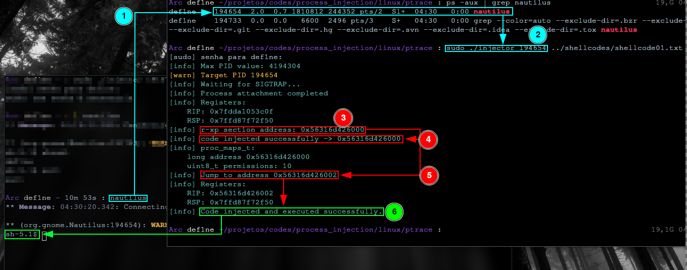

# linux-process-injection

### How run ?
- cd ptrace
- make all
- sudo ./injector PID <path_shellcode.txt>

### Shellcodes:
- shellcode01.txt -> spawn /bin/sh
- shellcode02.txt -> write("hello world!")

### References:
- https://www.real0day.com/hacking-tutorials/2017/11/6/injecting-a-running-process-linux
- https://github.com/W3ndige/linux-process-injection
- https://0x00sec.org/t/linux-infecting-running-processes/1097/4
- https://blog.f0b.org/2022/05/process-injection-on-linux-injecting-into-processes/
- https://www.youtube.com/watch?v=mXs-iXyA-54&t=989s
- https://jm33.me/process-injection-on-linux.html
